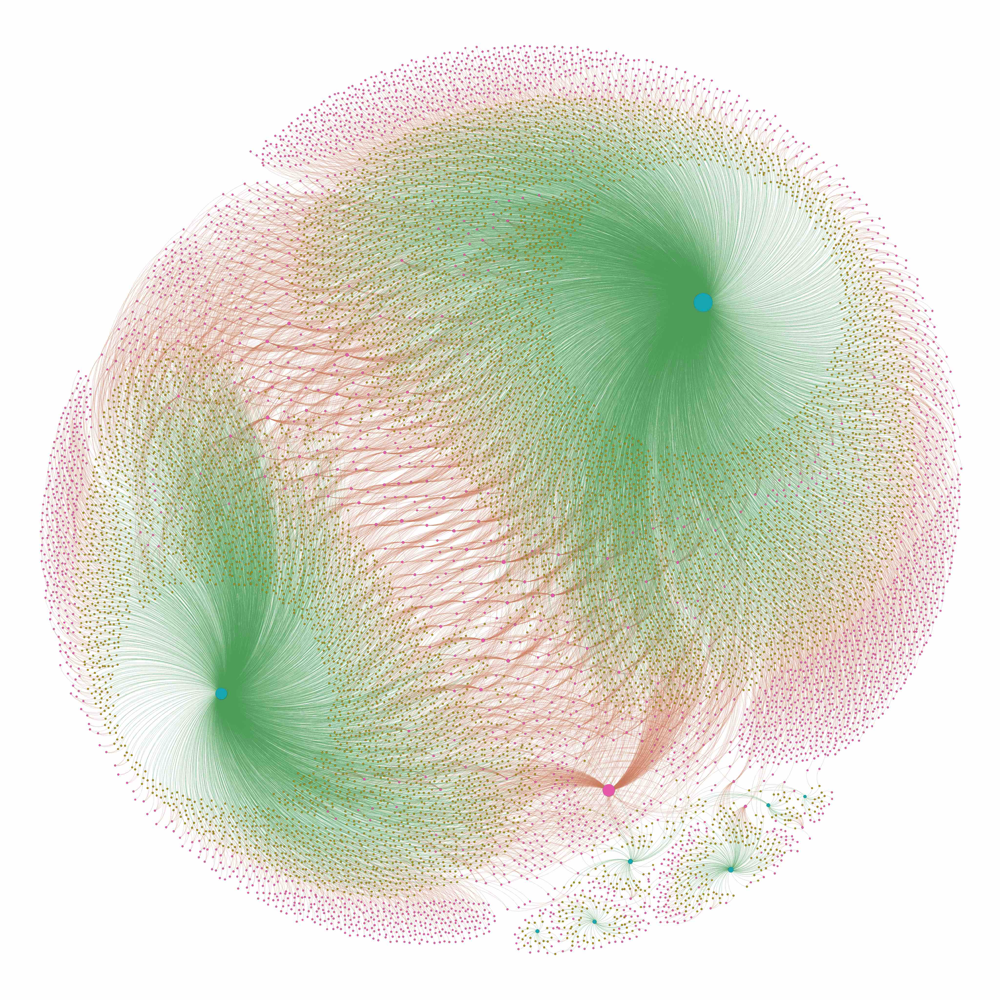

# NSF Graph
**Build visual graphs for National Science Foundation (NSF) awards, using MySQL and Gephi toolkit, implemented in Kotlin.**

### How to use

- Run `git clone https://github.com/BugenZhao/NSFGraph.git` in Terminal.app.
- Modify the server config in `src/com/bugenzhao/nsf/SQLServer.kt`, create a text file named `ps.txt` in the root directory which provides the password for SQL connection.
- Get `gephi-toolkit-0.9.2-all.jar` on https://gephi.org/toolkit/ .
- Get `mysql-connector-java-8.x.xx.jar` on https://dev.mysql.com/downloads/connector/j/ .
- Build the project and run it.
- Import the `.gexf` files into Gephi and then preview.

### BugenZhao, SJTU, Oct 2019.